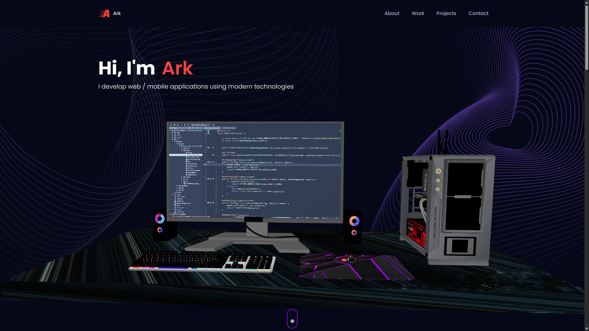
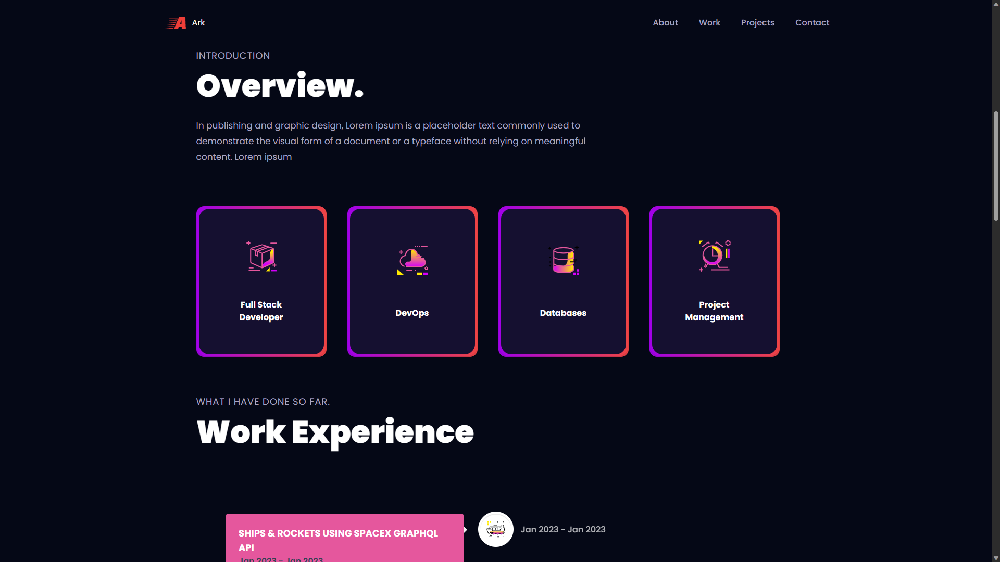
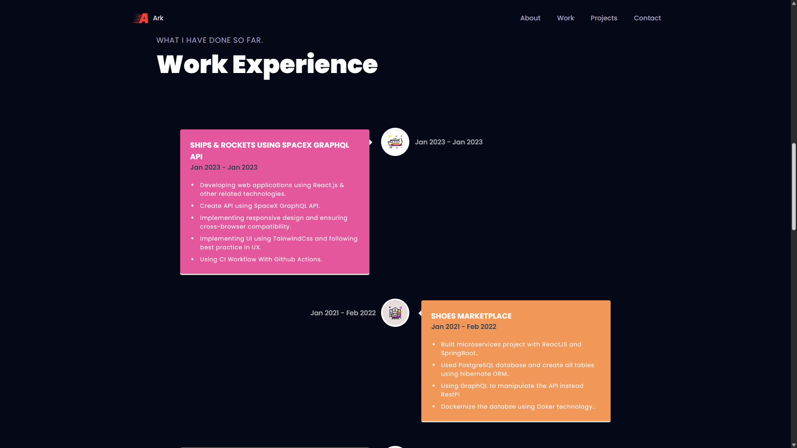
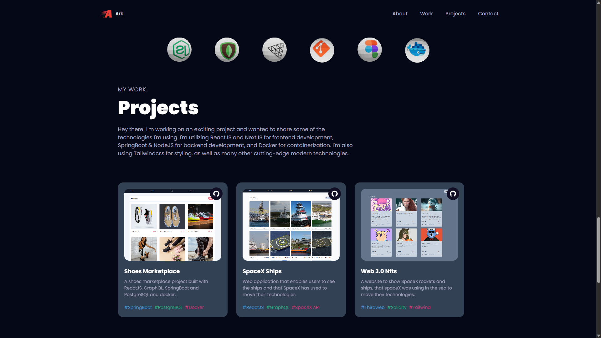
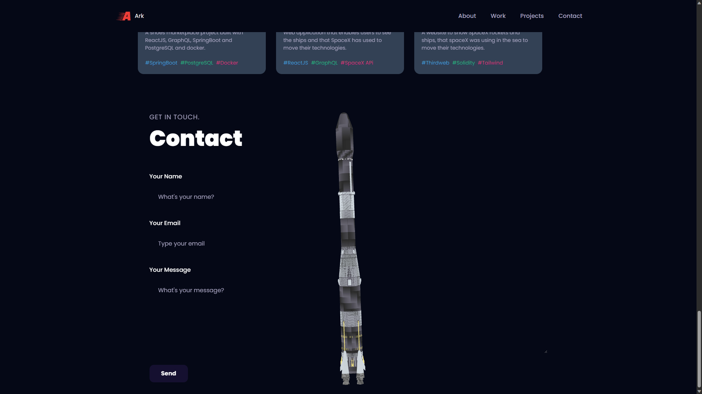

### Overview
3D Portfolio Using ReactJS and Tailwind and ThreeJS.

### Screenshots
1. Main View

2. About me

2. Work Experience

2. My Projects

2. Contact me



### Installation 
```bash 
npm i
```

### Running 
```bash 
npm run dev
```

### Browsing
```bash 
visit http://127.0.0.1:5173/
```

### Technologies Used
1. ReactJS
2. ThreeJS
3. Tailwind Css

### Resources
1.  Create cross-browser gradients: https://mdbootstrap.com/docs/standard/tools/design/gradients/

2. Free Models: https://free3d.com/ , https://www.cgtrader.com/free-3d-models , https://www.blenderkit.com/get-blenderkit/

3. Create Free Logo: http://logo.com/

4. Online Gltf editor: https://www.gltfeditor.com/

5. Svg Icons: https://www.iconshock.com/svg-icons/

Give it a star ⭐ Enjoy !
